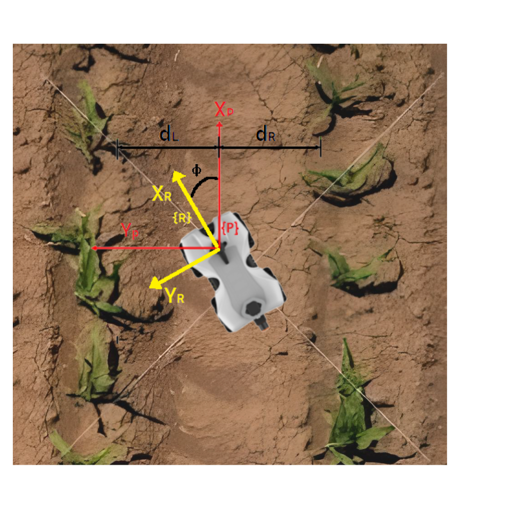
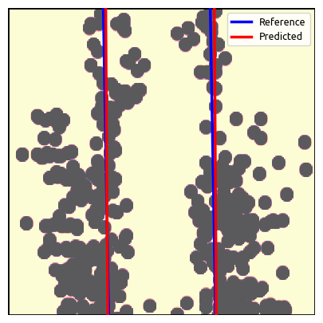

# IC_NN_Lidar

Population growth disproportionate to the increase in agricultural production requires the modernization of the technologies used. In this field, terrestrial robotics stands out for its versatility of applications to increase the sector's productivity. Featuring versatility on a single platform, the TerraSentia robot is a solution for navigation under canopy (under the canopy of plantations), an environment in which the lack of trust in sensors and the irregularity of the scene make navigation and navigation difficult. robot control. Thus, the use of a 2D LiDAR (Light Detection and Ranging) emerges as a resource to overcome the adversities described, in addition to enabling data collection in low-light environments.

That said, this Scientific Initiation project proposes the use of a Convolutional Neural Network on data from a 2D LiDAR sensor for navigation on the TerraSentia platform. Therefore, an increase in TerraSentia's performance in under canopy experiments is expected, compared to the state of the art through algorithms using only geometric heuristics instead of the Neural Network.

The initial approach identifies a perception system, in which the robot obtains information from the environment only through LiDAR, seeking alternatives for navigation without GNSS and without the use of a camera. In general, this approach, when achieving viable results, must be integrated into the TerraSentia platform, that is, the perception data must be loaded into a Path Planning algorithm and then into a Controller.

With the implemented approach, simulation results (using the Gazebo software) can generate system quality analyses. Furthermore, real tests with TerraSentia itself, as already carried out in the state of the art, will be able to measure the proposed alternative. With this, it is expected to expand the academic state of the art of land navigation, proving and comparing the viability of all technologies used.

> This project was supported by grants no. 2022/08330-9, São Paulo Research Foundation (FAPESP). The authors express his acknowledgments to EarthSense and Mobile Robotics Laboratory (LabRoM) from Engineering School of São Carlos (EESC-USP).


## Main Concepts

We present a system that is based on a generic agricultural environment, such as rows of corn plantations, but can be extended to systems with similar "corridor" characteristics, that is, those that have parallel boundaries on the sides. In this sense, the proposed system is based on the work of [1], who uses heuristic methods for perception by LiDAR. Inspired by this approach, the proposed system employs Deep Learning to solve the same problem. Additionally, in [2] it is presented, for the TerraSentia robot in a similar scenario, an implementation proposal based on sensory fusion.

In the proposed method, an approach based on Neural Networks is adopted to estimate the distance in relation to the lateral lines and the angle of rotation in relation to the straight line, from the LiDAR input data (which consist of 1081 points, covering an angle 270º with a resolution of 0.25º). The below figure visually represents the parameters of interest, including the distances *dL* and *dR*, as well as the azimuth *phi*.



As iLQR in the current implementation makes use of GNSS data, the system can support the use of Global coordinates (G), however, all perception is made in terms of relative to the robot (R). This guarantees modularity for "GNSS Denieded" implementations, that is, a scenario where global positioning signals are unreliable. By the figure below it is possible to verify the characterization of the data seen by LiDAR, in the figure on the right it is still possible to verify the labeling for the prediction.


For the perception task, a ResNet18 was used as an encoder, 11.7 million parameters, with the final layers modified to meet the output of 4 values (from the equations of the line). It is noteworthy that in the end the data can be easily converted into *phi*, *dR* and *dL* from the equations of the lines that best model the problem.

A supervised learning technique was chosen for a prediction task with a total of 4000 manually classified images. To strengthen the network learning, a Transfer Learning technique through an artificial dataset, generated through a selected probability distribution, was employed. At this stage, approximately 50000 images entered the network, forming a base for the main model.


The approach based on images is due to the amount of **noise** in the input data, generated by the non-linearities of the scenario. This amount of noise is problematic for a good understanding of the network, so it was decided to apply a series of techniques for pre-processing the images.

> The current implementation does not consider temporal information itself, however, future implementations expect that temporal neural networks can be aggregated to avoid problems with obstacles and occlusion of LiDAR.

> Note that the author already published the parcial results in the LARS 2023 [3].

## Parcial Results

At the moment, the system is in the process of training the network, with the following results:




| Indicators | Results |
|--------|-------|
| First epoch error | 1.21 |
| Last epoch error | 0.037 |
| Training time | 43min |
| Inference time | 32.77 ms |


## Installation

### Dependencies

``` shell
sudo apt install python3.8
sudo apt install python3-pip
```

```
pip install --upgrade setuptools
```

``` shell
pip install customtkinter==5.1.2 matplotlib==3.7.1 numpy==1.24.2 pandas==2.0.0 Pillow==9.5.0 scikit_learn==1.2.2 scipy==1.10.1 torch==2.0.0 torchsummary==1.5.1 torchvision==0.15.1
```

``` shell
pip install opencv-contrib-python>=4.7.0
```

### Full repo installation

``` shell
git clone https://github.com/Felipe-Tommaselli/IC_NN_Lidar.git
cd IC_NN_Lidar
```

> Download the dataset from google drive or generate your own dataset

### Run

``` shell
cd src
python3 main.py
```

## References

### Cited in the text

    [1] V. A. Higuti, A. E. Velasquez, D. V. Magalhaes, M. Becker, and G. Chowdhary, “Under canopy light detection and ranging-based
    autonomous navigation,” Journal of Field Robotics, vol. 36, no. 3, pp. 547–567, 2019.

    [2] A. E. B. Velasquez, V. A. H. Higuti, M. V. Gasparino, A. N. Sivakumar, M. Becker, and G. Chowdhary, “Multi-sensor fusion based
    robust row following for compact agricultural robots,” arXiv preprint arXiv:2106.15029, 2021.

    [3] F. A. Pinto, F. Tommaselli, M. V. Gasparino, and M. Becker, “Navigating with finesse: Leveraging neural network-based lidar perception and ilqr control for intelligent agriculture robotics,” in SBR-LARS 2023, oct 2023

### Others

    [4] M. V. Gasparino, V. A. Higuti, A. E. Velasquez, and M. Becker, “Improved localization in a corn crop row using a rotated laser  rangefinder for three-dimensional data acquisition,” Journal of the Brazilian Society of Mechanical Sciences and Engineering, vol. 42, no. 11, pp. 1–10, 2020.

    [5] M. V. Gasparino, V. A. Higuti, A. N. Sivakumar, A. E. Velasquez, M. Becker, and G. Chowdhary, “Cropnav: a framework for autonomous navigation in real farms,” in 2023 IEEE International Conference on Robotics and Automation (ICRA). IEEE, 2023, pp. 11 824–11 830.

    [6] R. Ravi, Y.-J. Lin, T. Shamseldin, M. Elbahnasawy, A. Masjedi,M. Crawford, and A. Habib, “Wheel-based lidar data for plant height and canopy cover evaluation to aid biomass prediction,” in IGARSS 2018 - 2018 IEEE International Geoscience and Remote Sensing Symposium, 2018, pp. 3242–3245.

    [7] Q. Ge, Q. Sun, S. E. Li, S. Zheng, W. Wu, and X. Chen, “Numerically stable dynamic bicycle model for discrete-time control,” in 2021 IEEE Intelligent Vehicles Symposium Workshops (IV Workshops), 2021, pp.
    128–134.

    [8] J. Aulinas, Y. Petillot, J. Salvi, and X. Llad ́o, “The slam problem: a survey,” Artificial Intelligence Research and Development, pp. 363371, 2008.

    [9] P. Heroux, “Principles of gnss, inertial, and multisensor integrated navigation systems.” Geomatica, vol. 62, no. 2, pp. 207–209, 2008.

    [10] J. P. Hespanha, “Lqg/lqr controller design,” Undergraduate Lecture Notes, University of California, Santa Barbara, California, USA, 2007.

    [11] K. Holkar and L. M. Waghmare, “An overview of model predictive control,” International Journal of control and automation, vol. 3, no. 4, pp. 47–63, 2010.

    [12] E. Kayacan and G. Chowdhary, “Tracking error learning control for precise mobile robot path tracking in outdoor environment,” CoRR, vol. abs/2103.11282, 2021.

